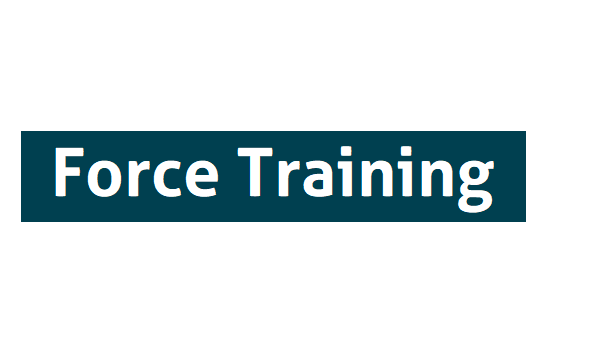
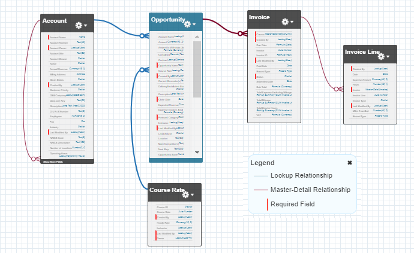
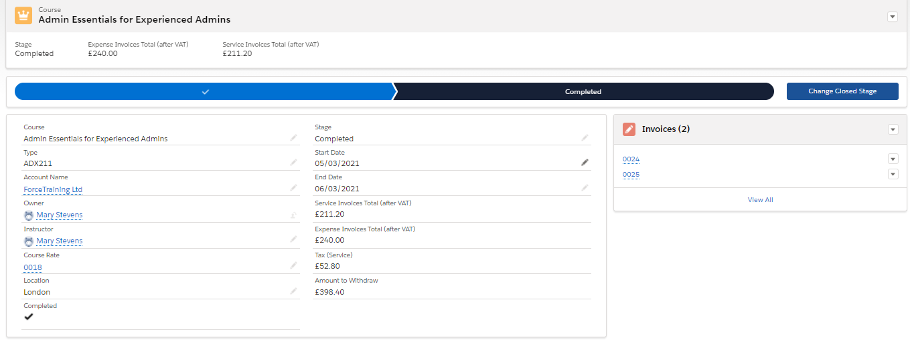
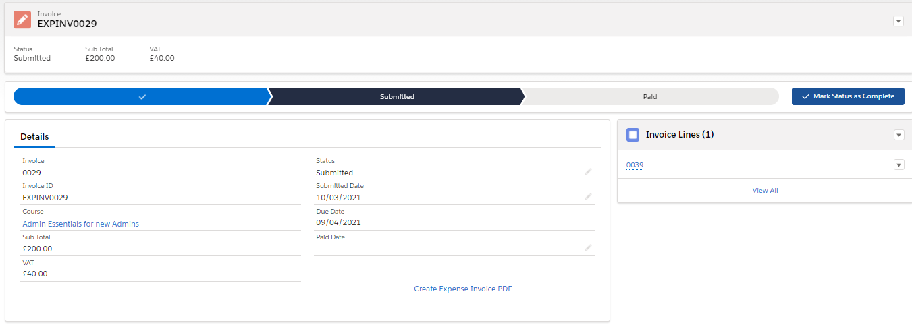
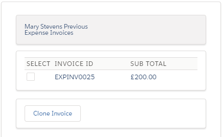

Fictional scenario of a Salesforce Training Partner requiring an invoice system for their sub-contractors. The Salesforce org will track the courses that they have scheduled, the trainers who will deliver them and the invoicing & expenses for each of their sub-contracting trainers.

**Requirements - Solutions**
* Apex sharing, send course notification emails, create/update calendar events - ```CourseTrigger.trigger```, ```CourseTriggerHandler.cls```
* Attach PDF to notification email - ```InvoiceTrigger.trigger```, ```InvoiceTriggerHandler.cls```
* Generate invoice PDF - ```ExpenseInvoicePDF.page```, ```ServiceInvoicePDF.page```
* Attach invoice PDF to parent course - ```AttachExtension.cls```, ```AttachInvoicePDF.page```
* Search and clone previous expense invoices - ```PreviousExpenseInvoices_CC.cls```, ```PreviousExpenseInvoices.page```

Includes unit tests for each .cls

**Unit Test Coverage: 95%**


[JIRA Link](https://towen.atlassian.net/jira/software/c/projects/FT/boards)


## Org Structure  

The org utilizes the standard object of Opportunity, renaming it Course. Three custom objects have been created, Course Rate (Course_Rate__c), Invoice (InvoiceC__c), and Invoice Line (InvoiceLine__c). The email log (Email_Log__c) custom object has also been created, to help with testing triggers that send emails.



## Course Example



## Invoice Example



## Invoice PDF Example


## Clone Previous Expense Invoices

A Visualforce page that let's an instructor see a list of their previous expense invoices. They can then clone a specific expense invoice, including all of it's related invoice line items, for the course that they are currently viewing.


