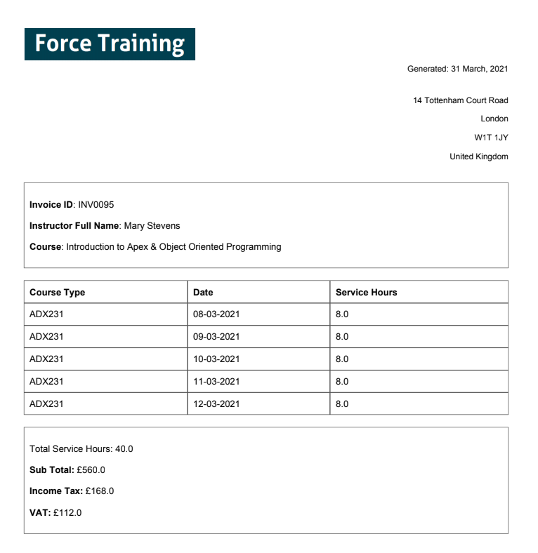

Fictional scenario of a Salesforce Training Partner requiring an invoice system for their sub-contractors. The Salesforce org will track the courses that they have scheduled, the trainers who will deliver them and the invoicing & expenses for each of their sub-contracting trainers.

**Custom Apex Classes:**
* Trigger for Opportunity object - ```CourseTrigger```, ```CourseTriggerHandler```
* Trigger for Invoice custom object - ```InvoiceTrigger```, ```InvoiceTriggerHandler```
* Custom Extension - ```AttachExtension```
* Custom Controller - ```PreviousExpenseInvoices_CC```
* Visualforce Pages - ```AttachInvoicePDF```, ```ExpenseInvoicePDF```, ```ServiceInvoicePDF```,```PreviousExpenseInvoices```

**Unit Test Coverage: 95%**


[JIRA Link](https://towen.atlassian.net/jira/software/c/projects/FT/boards)


## Schema  

The org utilizes the standard object of Opportunity, renaming it Course. Three custom objects have been created, Course Rate (Course_Rate__c), Invoice (InvoiceC__c), and Invoice Line (InvoiceLine__c). The email log (Email_Log__c) custom object has also been created, to help with testing triggers that send emails.


## Course Example


## Invoice Example


## Invoice PDF Example



## Clone Previous Expense Invoices

A Visualforce page that let's an instructor see a list of their previous expense invoices. They can then clone a specific expense invoice, including all of it's related invoice line items, for the course that they are currently viewing.


